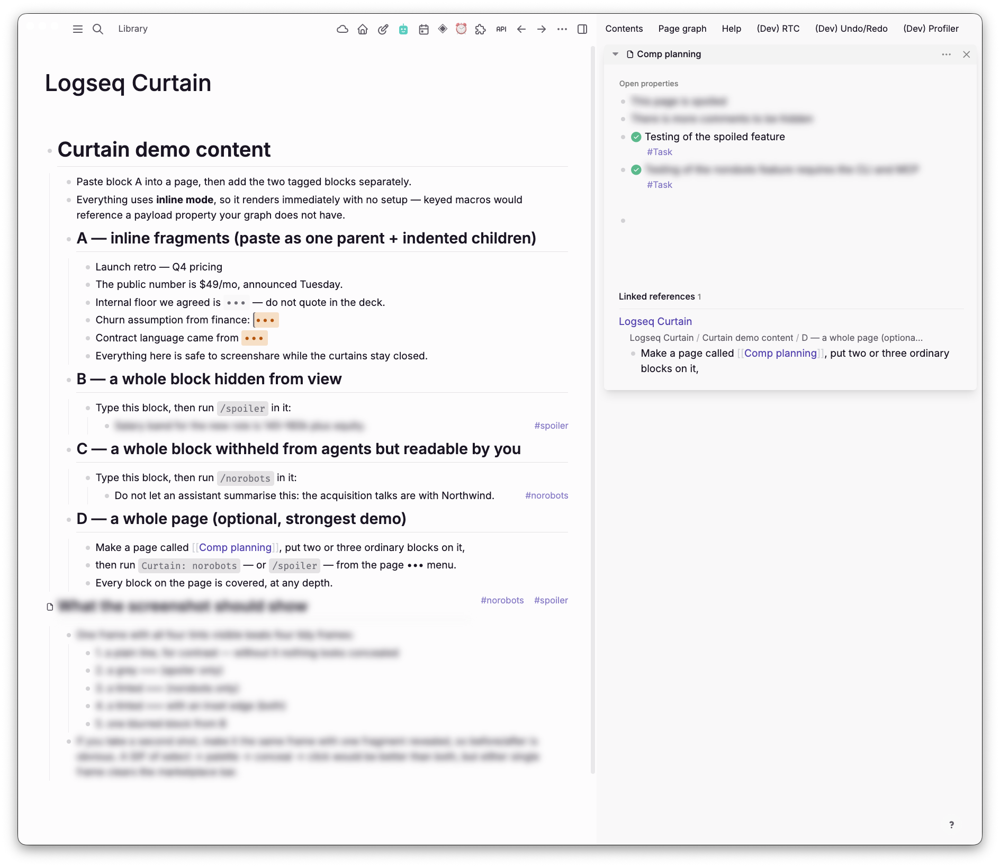
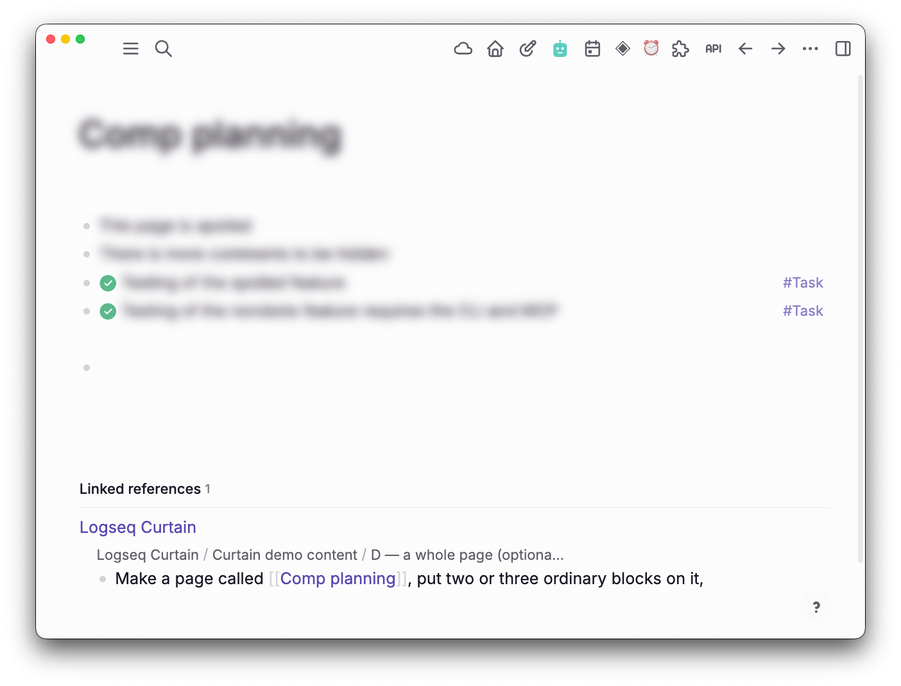

# Curtain - Hide & Redact

Conceal parts of a Logseq DB graph along two independent axes: from **human eyes** in the app, and from **AI agents** reading the graph through the CLI, MCP or browser automation.

```
#spoiler     hidden from humans, agents still read it
#norobots    humans still read it, withheld from agents
both         hidden from everyone
neither      ordinary content
```

Inline fragments use the same two flags:

```
{{renderer :curtain, k7, spoiler}}
{{renderer :curtain, k7, norobots}}
{{renderer :curtain, k7, spoiler norobots}}
```




Three inline fragments, each tinted by which axis applies — grey for `#spoiler`,
tinted for `#norobots`, tinted with an edge for both. The block under **B** is
blurred whole; the one under **C** carries `#norobots`, so it stays readable to
you and is withheld from agents. The sidebar shows a concealed page.



Tagging a page covers its title and everything written on it, at any depth.

## Using it

| Action | How |
|---|---|
| Tag a whole node | `/spoiler`, `/norobots`, `/veil` while editing |
| Conceal selected text | select it, then run **Curtain: conceal selected text** from the command palette |
| Conceal text you have not written yet | `/conceal` — inserts an empty curtain with the cursor inside it |

A slash command cannot conceal a selection: typing `/` *replaces* the selected
text, so there is nothing left to act on. The palette does not type into the
block, so the selection survives.

Hovering a blurred node reveals it. Before sharing your screen, run
**Curtain: lock** from the palette — it re-conceals everything revealed this
session and stops hover *and* click working until you unlock. There is also a
setting to turn hover-reveal off permanently.

Curtain ships **no default keyboard shortcuts** — any chord risks colliding
with Logseq, another plugin, or the OS. Assign your own under
**Settings → Keymap → Plugins**.

## Two storage modes

Every concealed fragment renders as `•••` whichever axis is set, tinted by
axis so you can see which is in force without revealing it. Click to reveal.

| Mode | Macro | Text lives in | Trade |
|---|---|---|---|
| `property` *(default)* | `{{renderer :curtain, ur, spoiler}}` | a hidden property | Strongest — the text is not in the block title, so search, exports and the graph view never see it |
| `inline` | `{{renderer :curtain, humans and robots, spoiler}}` | the macro itself | Editable in place, copies natively — but the text *is* in the block title, so search and exports can see it. Commas normalise |

Set the default in plugin settings. Two palette commands convert existing
fragments either way, so a mode choice is never permanent.

## What Curtain is not

Curtain is **concealment, not confidentiality.** It filters read paths; it does not encrypt anything. The payload sits in plaintext in SQLite, in db-sync payloads and in EDN exports, so anyone holding the graph file holds the content.

Use it for spoilers, screenshares, demo graphs, and keeping agents from ingesting content you would rather they skip. Do not use it for credentials.

The `#norobots` axis is an honor system with one exception. Agents that route through a filtering MCP server genuinely never receive the content; every other agent is trusted to respect the tag, exactly as with `robots.txt`.

## The agent contract

[NOROBOTS.md](NOROBOTS.md) is the portable statement of what `#norobots` asks
of an AI agent. Point agents at it — a skill instruction, a `CLAUDE.md`, or a
note in the graph root. Through a filtering MCP server the rule is enforced;
everywhere else that file is the only thing asking.

## Documentation

- [docs/SPEC.md](docs/SPEC.md) — vocabulary, storage model, architecture
- [docs/leak-surfaces.md](docs/leak-surfaces.md) — verified leak inventory and the test matrix
- [NOROBOTS.md](NOROBOTS.md) — the contract agents are pointed at
- [agent/](agent/) — how to point them at it: a skill, a `CLAUDE.md` block, or the graph root
- [TASKS.md](TASKS.md) — build order
